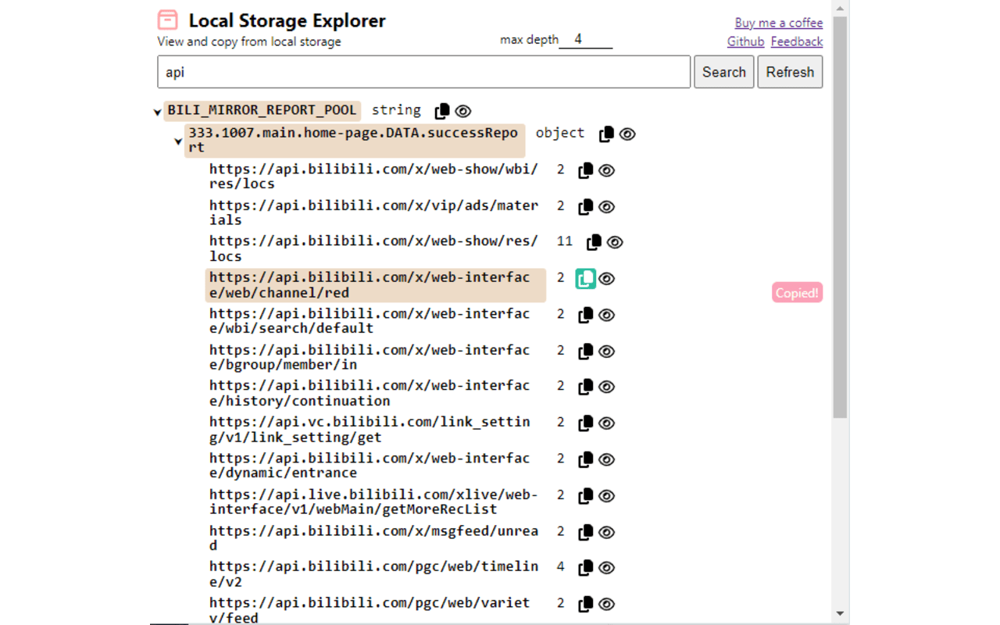
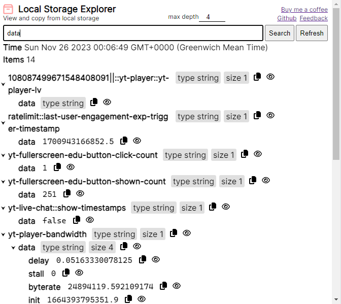

# Local Storage Explorer
> Status: waiting for Chrome review...

Easily view, copy or search local storage content from any webpage by clicking on the extension icon. It also supports automatically deserialize json string.

## Usage
Local storage maintains a separate storage area for each given origin, data persists even when the browser is closed and reopened. It gets cleared only through JavaScript, or clearing the Browser cache / Locally Stored Data. It is a JSON object. For more information about local storage, see https://developer.mozilla.org/en-US/docs/Web/API/Window/localStorage

This extension allow you to visualize, copy or search the content of the local storage easily. After clicking on the extension icon, you will see a popup, the extension will fetch the local storage content live which will be loaded into the popup shortly, it is a tree structure displaying the content of the current active tab's local storage.

The local storage content is displayed under the "LOCAL STORAGE" key, note that the "LOCAL STORAGE" key itself is not present in the local storage, it is merely for completeness. Next to each key are:
- metadata about the value associated with this key
- copy icon which when clicked, copy the value associated with this key to your clipboard
- eye icon which when clicked, display the full content of the key and value, (this is because the key/value can be very large and not easy to work with when expanded)
You can also click on the key/arrow icon on its left to collapse/expand the content of the item.

## Options
- You can edit the `max depth` value at the top to a right level for your needs, it can also be set to a lower value to improve performance.

## Screenshots
### Main

### Search

